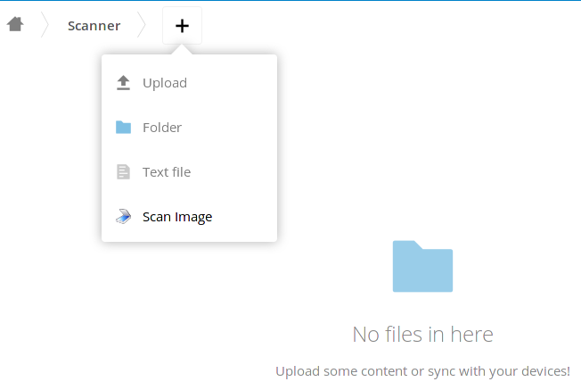
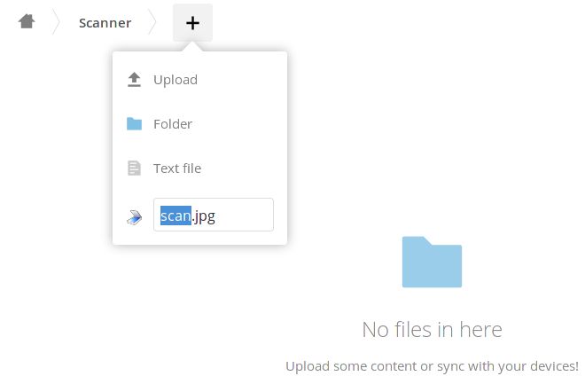
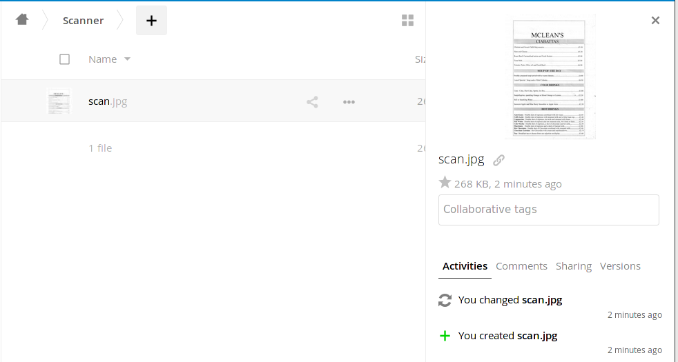

# Scanner - Scan images directly into NextCloud

**Scanner** is a NextCloud app which adds the ability to scan images from a
local or network-available scanner (via the SANE tools) directly into
Nextcloud.

## Installation

* Place the code in [your nextcloud folder]/apps/scanner
* Make sure you have `scanimage` and `pnmtojpeg` binaries available
  * On Debian, these are provided by the `sane-utils` and `netpbm` packages
* Ensure executing `scanimage -L` on your NextCloud server returns the correct scanner
  * Configuring SANE is beyond this README, but:
    * For scanners shared by another host, add the hostname to /etc/sane.d/net.conf

## Configuration

Currently **Scanner** has no settings, so there is no in-app configuration.

## Usage

**Scanner** adds a new menu entry to the **Files** menu:

Selecting this will allow you to specify a filename as usual (default `scan.jpg`):

The app will then call out to scanimage to get a scan, and put the result in
the specified file:

## Known Issues

* Pressing `Enter` after entering a filename will appear to do nothing
  * This is because scanning is a slow process and no spinner is yet implemented
* Only the default scanner is used for `scanimage`
  * If you have more than one scanner, scanimage will only use the first
* Files view does not refresh to show the scanned file
  * As a workaround, reload the page or change folder and then come back

More issues / roadmap details in the [TODO](TODO.md) file

## License / Copyright

Copyright (c) 2016 Greg Sutcliffe

This program is free software: you can redistribute it and/or modify
it under the terms of the GNU Affero General Public License as published by
the Free Software Foundation, either version 3 of the License, or
(at your option) any later version.

This program is distributed in the hope that it will be useful,
but WITHOUT ANY WARRANTY; without even the implied warranty of
MERCHANTABILITY or FITNESS FOR A PARTICULAR PURPOSE.  See the
GNU Affero General Public License for more details.

You should have received a copy of the GNU Affero General Public License
along with this program.  If not, see <http://www.gnu.org/licenses/>.

### Extra files

Scanner logo obtained from
[Wikimedia Commons](https://commons.wikimedia.org/wiki/File:Gnome-dev-scanner.svg)
(LGPL)
